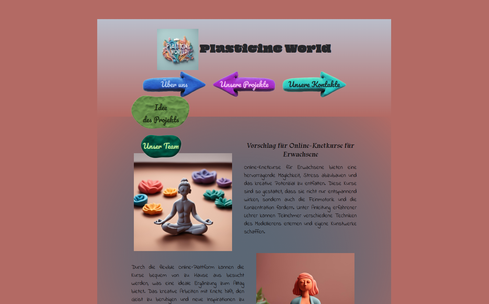
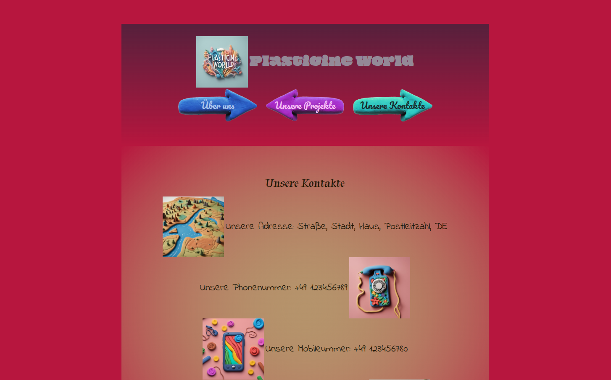

# 🌱 The Very First Projekt

This is my **very first web project**, created after completing the *Orientierungskurs*. I built everything from scratch using only **HTML** and **CSS** — layout, structure, visuals, and content. 

It may not be perfect, but it has a piece of me in it.

🔗 **Live demo**: [https://marrozhkova.github.io/the-very-first-projekt/](https://marrozhkova.github.io/the-very-first-projekt/)

---

## ✨ Highlights

- 🧠 Entirely handcrafted HTML/CSS — no frameworks, no generators
- 🎨 Original layout, color scheme, and **AI-generated visuals** (thank you, AI!)
- 📝 Custom text and conceptual design by me
- 📱 Responsive layout (mobile-optimized to 468px)
- 🧪 A personal milestone: first ever project after starting my web dev journey

---

## 🧑‍💻 Tech Stack

- **HTML5**
- **CSS3**
- 📷 Images created with help from **AI image generation tools**
- **GitHub Pages** for hosting

---

| Screenshot 1 | Screenshot 2 | Screenshot 3 |
|---------|--------|--------|
|  |  |  |

---

## 🚀 Local Setup

```bash
git clone https://github.com/marrozhkova/the-very-first-projekt.git
cd the-very-first-projekt
# Open index.html in your browser
```
## 👤 Author

**Maryna Rozhkova**  
Frontend Developer | Learner by Heart  
📫 [mar.rozhkova@gmail.com](mailto:mar.rozhkova@gmail.com)  
🌐 [Portfolio](https://marrozhkova-portfolio.vercel.app/)

---

## 💬 Note
Thank you, AI — for helping me imagine and create the visuals.
And thank you, visitor, for taking a moment to see where it all began.
